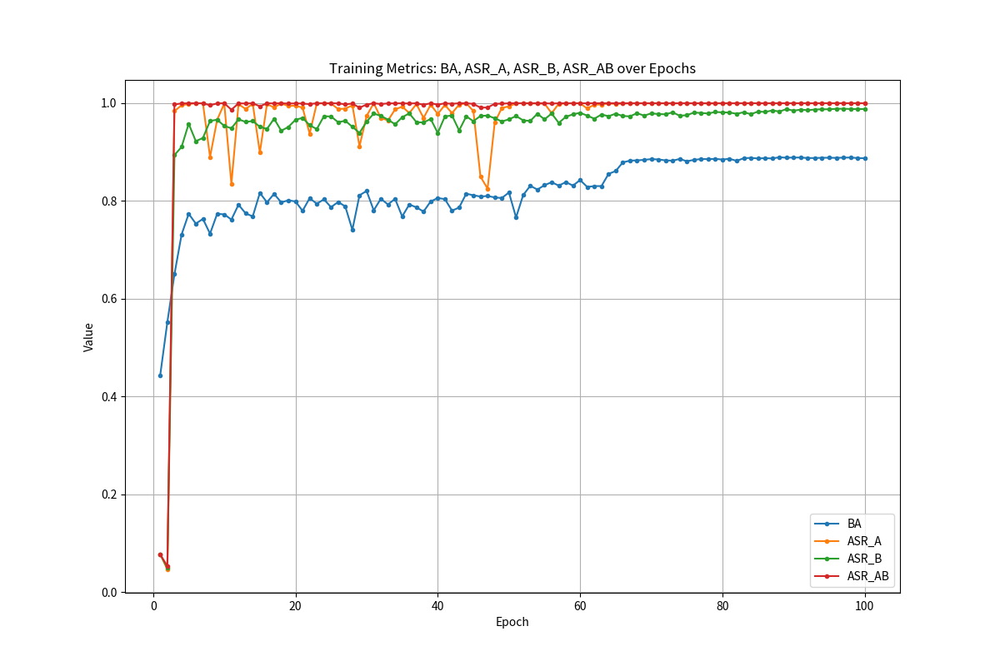

# Original-and-Substitute-Backdoor

A backdoor attack framework in which a conventional visible trigger serves as the original trigger and is relatively easy to detect, while a substitute trigger is adversarially generated in the frequency domain under feature-space guidance to inherit its attack effect.

## Overview

Most existing studies on multi-trigger backdoor attacks primarily adopt a **parallel poisoning** setting, where different triggers are injected into different poisoned samples. However, this setting does not sufficiently investigate the conditions under which multiple triggers can coexist within the same sample while still being able to activate the backdoor independently.

More specifically, an important question remains open: can different triggers be embedded into the same input, remain mutually compatible, and still induce malicious behavior independently?

This project focuses on this latter setting. In particular, it explores a backdoor framework composed of an **original trigger** and a **substitute trigger** generated to inherit the attack effect of the original one.

The main objectives are to investigate whether the original trigger and the substitute trigger can:

- coexist within the same poisoned sample while remaining compatible;
- activate the backdoor independently;
- maintain robustness against representative backdoor defense methods.

## Experimental Pipeline

The overall experimental pipeline is summarized as follows.

### Step 1. Clean Model Pretraining

A clean model is first pretrained using only benign data. In the current implementation, **CIFAR-10** is used as the dataset and **ResNet-18** is adopted as the backbone architecture.

### Step 2. Original Trigger Feature Extraction

The training set is poisoned with an original trigger, and the poisoned samples are then passed through the clean model to obtain their feature-space representations.

In the current experiments, **BadNet** is used as the original trigger. Preliminary experiments suggest that the framework may also be extended to many conventional triggers in both the spatial and frequency domains.

### Step 3. Substitute Trigger Generation

A substitute trigger is generated by an autoencoder. The optimization objective is to control the magnitude of the substitute trigger’s feature-space displacement while maintaining a designed relationship with the displacement induced by the original trigger, particularly under an orthogonality-oriented objective.

### Step 4. Coupled Trigger Training

## Repository Structure

```text
Original-and-Substitute-Backdoor/
├── images/
│   ├── backdoored_model.jpg
│   ├── defense_test_i_bau.png
│   ├── invisible_test_and_trigger_visualization.png
│   ├── only_badnet_trigger.png
│   └── only_substitute_trigger.png
├── src/
│   ├── step_1_pretrain_clean_model.py
│   ├── step_2_3_sub_trigger.py
│   └── step_4_train_model.py
├── tests/
│   ├── defense_i_bau_test.py
│   ├── independent_only_badnet_test.py
│   ├── independent_only_substitute_test.py
│   └── invisible_test.py
└── README.md
```

## Invisible Test and Trigger Visualization


## Backdoored Model Performance

## Notes
This repository is currently intended for research demonstration.
The project is still under active development.
More implementation details and experimental results will be added progressively.
## Disclaimer

This repository contains unpublished research ideas and is shared for research demonstration purposes only. 
